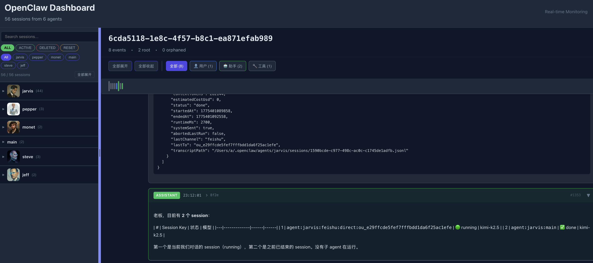

# OpenClaw Session Viewer

一个用于实时查看和监控 OpenClaw 会话的 Dashboard 应用。



## 功能特性

- 📊 **实时会话监控** - 通过 WebSocket 实时推送会话更新
- 🎯 **多 Agent 支持** - 同时监控多个 OpenClaw Agent 的会话
- 📋 **会话列表** - 按 Agent 分组显示，支持折叠/展开
- 🔍 **搜索和过滤** - 按状态、Agent、关键词搜索会话
- 🎨 **头像显示** - 自动加载 Agent 配置的头像图片
- 📋 **时间线视图** - 按时间顺序展示事件链，支持父子关系可视化
- 🎯 **缩略图导航** - 快速定位到任意事件位置
- 📌 **固定头部** - 会话信息和控制栏在滚动时保持可见
- 🎨 **消息卡片** - 不同角色（User/Assistant/Tool）用不同颜色区分
- 🔧 **工具调用可视化** - 显示工具名称、参数和返回结果
- ⌨️ **Markdown 渲染** - 支持 Markdown 格式的消息内容
- 📱 **响应式布局** - 可调整侧边栏宽度

## 快速开始

### 0. 安装依赖

```bash
git clone https://github.com/AllenLeong/openclaw-session-viewer.git
cd oc-dashboard
npm install
```

### 1. 启动后端服务器

```bash
npm run server
```

后端将在 `http://localhost:3001` 启动，WebSocket 端点：`ws://localhost:3001/ws`

### 2. 启动前端开发服务器

```bash
npm run dev
```

前端将在 `http://localhost:5173` 启动

### 或者一键启动

```bash
./start.sh
```

## 技术栈

- **前端**: React 19 + TypeScript + Vite
- **后端**: Node.js + Express + WebSocket (ws)
- **文件监听**: chokidar
- **Markdown 渲染**: react-markdown

## API 端点

### REST API

| 端点 | 方法 | 描述 |
|------|------|------|
| `/api/sessions` | GET | 获取所有会话列表 |
| `/api/session/:id` | GET | 获取单个会话详情 |
| `/api/agent/:id/avatar` | GET | 获取 Agent 头像图片 |
| `/api/health` | GET | 健康检查 |

### WebSocket

连接端点：`ws://localhost:3001/ws`

消息类型：
- `session-updated` - 会话更新
- `session-new` - 新会话创建

## 项目结构

```
oc-dashboard/
├── src/                        # 前端源代码
│   ├── components/             # React 组件
│   │   ├── SessionList.tsx     # 会话列表组件
│   │   ├── Timeline.tsx        # 时间线组件
│   │   └── MessageCard.tsx     # 消息卡片组件
│   ├── hooks/                  # 自定义 Hooks
│   │   ├── useSessions.ts      # 会话管理 Hook
│   │   └── useWebSocket.ts     # WebSocket 连接 Hook
│   ├── types/                  # TypeScript 类型定义
│   │   └── index.ts
│   ├── App.tsx                 # 主应用组件
│   └── main.tsx                # 入口文件
├── server/                     # 后端服务器
│   ├── server.ts               # Express + WebSocket 服务器
│   ├── parser.ts               # JSONL 文件解析器
│   └── fileWatcher.ts          # 文件监听器
├── public/                     # 静态资源
├── package.json
├── start.sh                    # 一键启动脚本
└── README.md
```

## 数据格式

### JSONL 事件类型

| Type | 描述 |
|------|------|
| `session` | Session 元数据 |
| `message` | 对话消息 (user/assistant/toolResult) |
| `thinking_level_change` | 思考模式切换 |
| `model_change` | 模型切换 |
| `custom` | 自定义事件 |

### Message 角色

- `user` - 用户消息
- `assistant` - AI 助手回复
- `toolResult` - 工具调用结果

## 配置

### Agent 头像配置

在 `openclaw.json` 中配置：

```json
{
  "agents": {
    "list": [
      {
        "id": "jarvis",
        "workspace": "/Users/a/.openclaw/workspace",
        "identity": {
          "avatar": "portrait.png"
        }
      }
    ]
  }
}
```

头像文件路径：`{workspace}/{avatar}`

### 会话数据目录

默认会话数据目录：`/Users/a/.openclaw/agents/`

如需修改，编辑 `server/server.ts`:

```typescript
const SESSIONS_ROOT_DIR = '/Users/a/.openclaw/agents';
const OPENCLAW_CONFIG_PATH = '/Users/a/.openclaw/openclaw.json';
```

## 开发

### 生产构建

```bash
npm run build
npm run preview
```

### 代码检查

```bash
npm run lint
```

## License

MIT
